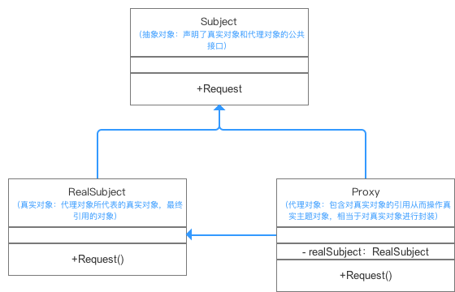

#代理模式（Proxy Pattern）

代理模式用于延迟处理操作或者在进行实际操作前后进行其他处理。

## 目录


## 介绍

### 定义

给目标对象提供一个代理对象，并由代理对象控制对目标对象的引用
1. 代理对象：起到中介作用，连接客户端和目标对象。
2. 例子：电脑桌面的快捷方式。电脑对某个程序提供一个快捷方式（代理对象），
快捷方式连接客户端和程序，客户端通过操作快捷方式就可以操作那个程序。

### 主要作用

通过引入“代理对象”的方式来间接访问“目标对象”

### 解决的问题

防止直接访问目标对象给系统带来的不必要复杂性。

## 模式原理

### UML类图&组成



### 实例讲解

接下来用一个实例来对代理模式进行更深一步的介绍。
 + a.实例概况
    * 背景：小明希望买一台最新的iphoneX；
    * 冲突：国内还没上，只有美国才有； 
    * 解决方案：寻找代购进行购买。
> 代购（代理对象）代替我（真实对象）去买iphoneX(间接访问的操作)

+ b.使用步骤
    * 步骤1：**创建抽象对象接口（Subject）:** 声明你（真实对象）需要让代购（代理对象）
    帮忙做的事（买iphoneX）
   
    ```
     type Subject interface {
        buyIphoneX()
    }
    
    ```
    
    * 步骤2：**创建真实对象类（RealSubject）,即“我”**
  
    ```
    type RealSubject struct {        
    }
    
    func (*RealSubject)buyIphoneX(){
        fmt.Println("买一台iphoneX")
    }
    
    ```
   
    * 步骤3：**创建代理对象类（Proxy）,即“代购”**，并通过代理类创建真实对象实例
    并访问其方法
   
    ```
    type Proxy struct {        
    }
    
    func (this *Proxy)buyIphoneX(){
         //引用并创建真实对象实例，即”我“
         var realSubject *RealSubject  = new(RealSubject)
         
         //调用真实对象的方法，并进行代理购买iphoneX
         realSubject.buyIphoneX()
         
         //代理额外的操作
         this.WrapIphoneX()
    }
    
    func (this *Proxy)WrapIphoneX(){
        fmt.Println("用盒子包装好iphoneX")
    }
    ```
   
    * **客户端调用**
   
    ```
    var  proxy *Subject = new(Proxy)
    proxy.buyMac()；
    ```

## 代理模式优缺点

### 优点

* 协调调用者和被调用者，降低了系统的耦合度；
* 代理对象作为客户端和目标对象之间的中介，起到了保护目标对象的作用。

### 缺点

* 由于在客户端和真实主题之间增加了代理对象，因此会造成请求的处理速度变慢；
* 实现代理模式需要额外的工作（有些代理模式的实现非常复杂），从而增加了系统实现
的复杂度。

## 代理模式分类（前4种常用）：

1. 远程代理：
    + 描述：为一个对象在不同的地址空间提供局部的代表。
    + 目的：隐藏一个对象存在于不同地址空间的事实； 远程机器可能具有更好
    的计算性能与处理速度，可以快速响应并处理客户端请求。  
    
2. 虚代理
    + 描述：通过使用一个小的对象代理一个开销大的对象。
    + 目的：减少系统开销。

3. 保护代理(Protect or Access)
    + 描述：控制目标对象的访问，给不同用户提供不同的访问权限。
    + 目的：控制对真实对象的访问权限。 

4. 智能引用(Smart Reference)
    + 描述：在访问对象时附加额外操作（如耗时操作、计算访问次数等）。
    + 目的：在不影响对象类的情况下，在访问对象时进行更多的操作。

5. 防火墙代理(Firewall)
    + 描述：
    + 目的：保护目标不让恶意用户靠近。

6. Cache 代理
    + 描述：
    + 目的：为结果提供临时的存储空间，以便其他客户端调用。

7. 同步代理(Synchronization)
    + 描述：
    + 目的：使几个用户能够同时使用一个对象而没有冲突。

8. 写入时复制代理（Copy-on-Write）
    + 描述：虚拟代理的一种。把复制（克隆）拖延到只有在客户端需要时，才真正采取行动。
    + 目的：

